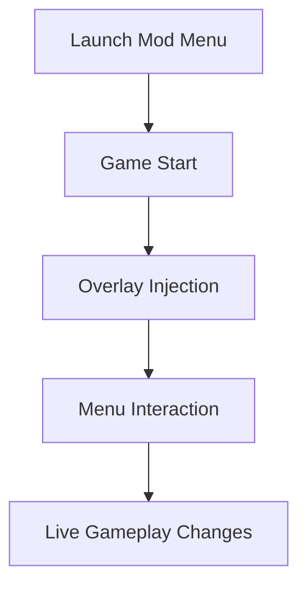

# YAPYAP Mod Menu

There is a moment in every game when you wish the rules would loosen their grip.
**YAPYAP Mod Menu** exists precisely for that moment — not as a hammer, but as a set of finely tuned instruments. It opens a quiet backstage door where mechanics can be adjusted, paused, accelerated, or softened, all without tearing the fabric of the experience.

This is not chaos.
This is **control**.

---

## 🌊 Overview

YAPYAP Mod Menu is an external gameplay modification tool that provides a **live in-game menu** for adjusting core systems in real time. Instead of relying on hotkeys alone, everything is laid out visually — switches, sliders, and values waiting for your touch.

It’s designed for players who want to *see* what they change, who enjoy tuning the game like a delicate machine rather than flipping blind switches.

---

## 🎛 Core Menu Features

Each option lives inside a clean overlay, categorized for clarity and speed.

* ❤️ **God Mode / Health Lock** – Survive freely or fine-tune difficulty
* 💰 **Resource Editor** – Freeze or adjust in-game materials
* 🌀 **Game Speed Slider** – Slow motion or accelerated flow
* 🎯 **Damage Control** – Modify outgoing or incoming damage
* 🧲 **Utility Toggles** – Skip limits, cooldowns, or restrictions
* 🧠 **Live Value Updates** – Changes apply instantly

Every toggle whispers instead of shouting — smooth, immediate, reversible.

---

## ✨ What Makes the Mod Menu Different?

Some tools live outside the screen.
This one lives *within* it.

* Visual menu instead of memorized hotkeys
* Organized sections for fast navigation
* Adjustable sliders instead of fixed presets
* Minimal overlay that never steals focus
* Built for experimentation, not brute force

It feels less like cheating… and more like *editing reality*.

---

## ⚡ Setup & First Launch

A small ritual, almost meditative:

1. Close the game
2. Run **YAPYAP Mod Menu** as Administrator
3. Launch the game
4. Wait for the confirmation message
5. Press **INSERT** to open the menu

Menu navigation:

* Mouse-controlled UI
* Toggle buttons for instant changes
* Sliders for precision tuning

No installation. No permanent files. When closed, it vanishes.

---

## 🔁 How the Mod Menu Interacts

Everything happens in real time, like adjusting sails while already at sea.

---

## ❓ FAQ

**Does the mod menu save my settings?**
Settings reset each session to avoid unwanted persistence.

**Is this safer than trainers?**
It offers the same level of safety when used offline, with added visibility.

**Can I disable everything instantly?**
Yes. One menu toggle returns the game to default behavior.

**Will it corrupt saves?**
No game files or saves are modified.

**Is it beginner-friendly?**
Very. Visual menus remove the need to remember commands or keys.

---

## 🌙 Final Thoughts

YAPYAP Mod Menu doesn’t demand dominance — it offers **dialogue** with the game.
You adjust. The world responds. You learn.

It’s for curious players.
For explorers.
For those who enjoy shaping experience rather than conquering it.

If YAPYAP is a story, this menu lets you linger between the lines.

---
